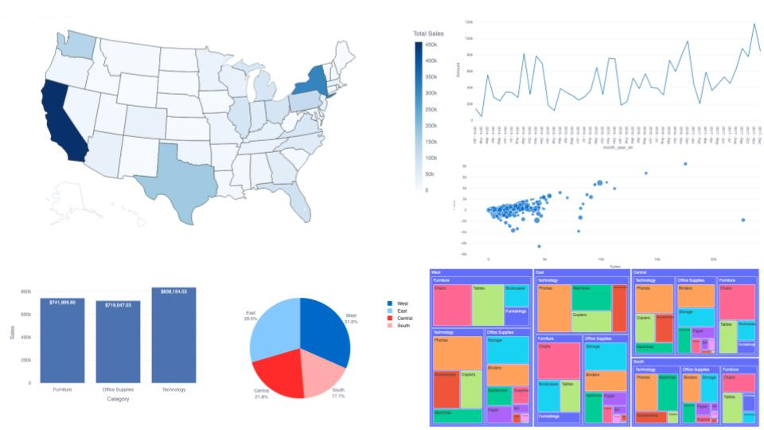
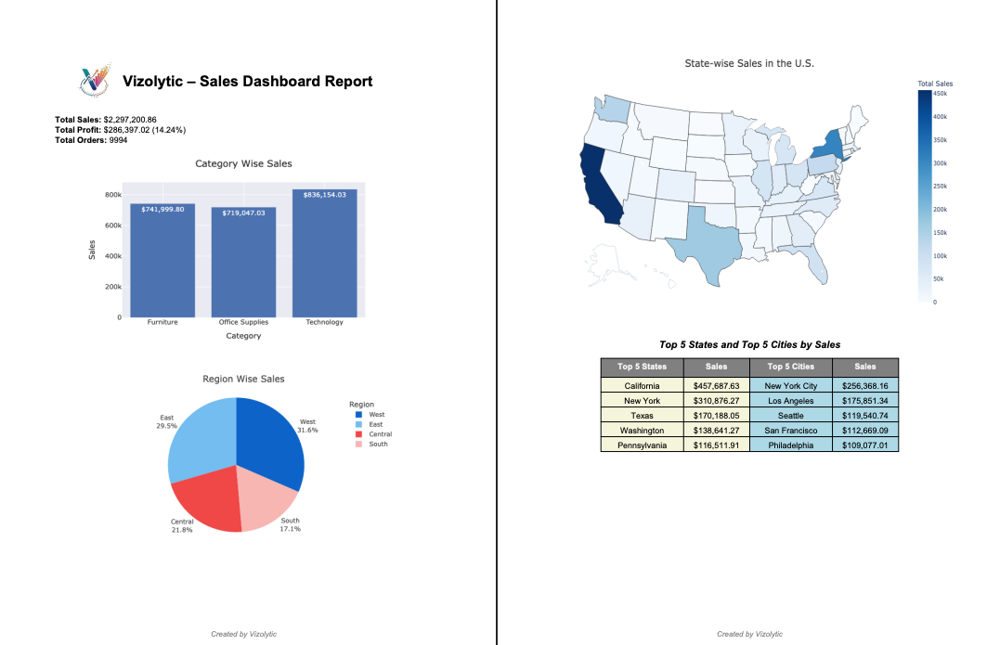

# Vizolytic – Turning Data Into Decisions

[](https://vizolytic.streamlit.app/)  
[](https://github.com/A-Kannika/Vizolytic)  

**Vizolytic** is an interactive sales analytics dashboard built with **Streamlit**, **Plotly**, and **Pandas**. It enables users to explore and visualize sales data with advanced charts, tables, and reports, helping businesses make informed decisions.

---

## Features

- **Upload & Preview Data**: Upload CSV, Excel, or TXT files and preview the first few rows.  
- **Dynamic Filtering**: Filter sales data by Region, State, and City through an interactive sidebar.  
- **Data Visualization**:  
  - Bar charts for category-wise sales  
  - Pie charts for region-wise and segment-wise sales  
  - Scatter plots to explore relationships between Sales, Profit, and Quantity  
  - TreeMap for hierarchical view: Region → Category → Sub-Category  
  - Choropleth heat map for U.S. state-wise sales  
- **Time Series Analysis**: Month-wise sales trends with downloadable CSV summary.  
- **Summary & Reports**:  
  - Top 5 states and cities by sales  
  - Export a polished **PDF report** including charts, tables, and key metrics  
- **Download Options**: Download filtered datasets or the complete dataset as CSV.

---

## Demo

Live Streamlit app: [https://vizolytic.streamlit.app/](https://vizolytic.streamlit.app/)  

GitHub repository: [https://github.com/A-Kannika/Vizolytic](https://github.com/A-Kannika/Vizolytic)

---

## Screenshots

### Dashboard Preview  
  

### PDF Report Sample  
  

*(Replace the image paths with your actual screenshots in the repo.)*

---

## Installation

1. **Clone the repository**:

```bash
git clone https://github.com/A-Kannika/Vizolytic.git
cd Vizolytic
```

2. **Create and activate a virtual environment:**:
   
```bash
python -m venv venv
source venv/bin/activate   # macOS/Linux
venv\Scripts\activate      # Windows
```

3. **Install dependencies:**:
   
```bash
pip install -r requirements.txt
```

4. **Run the app:**:
   
```bash
streamlit run app.py
```

## Requirements
- Python 3.10+
- Streamlit
- Pandas
- Plotly
- ReportLab
- Matplotlib
(See requirements.txt for full list)

## How It Works
- Upload your dataset (CSV, XLSX, TXT).
- Filter your data using Region, State, or City in the sidebar.
- Explore visualizations: bar charts, pie charts, scatter plots, TreeMaps, and heat maps.
- Download filtered datasets or generate a PDF report with key insights.

## License
This project is open source and licensed under the MIT License.
You are free to use, copy, modify, merge, publish, distribute, sublicense, and/or sell copies of this project, provided that you include this license and copyright notice in all copies or substantial portions of the software.

## Contact

- Developed by Kannika Armstrong (inspired by https://www.youtube.com/watch?v=7yAw1nPareM)
- GitHub: https://github.com/A-Kannika
- Portfolio: https://a-kannika.github.io/KannikaA/
